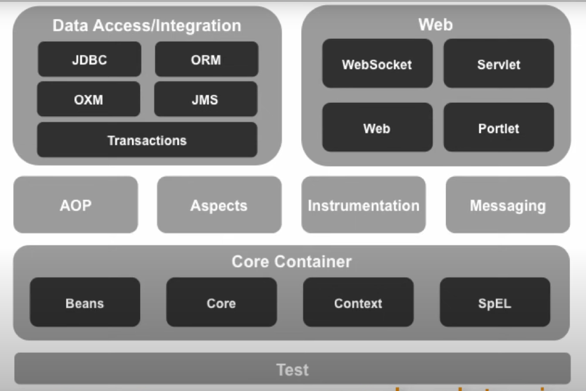
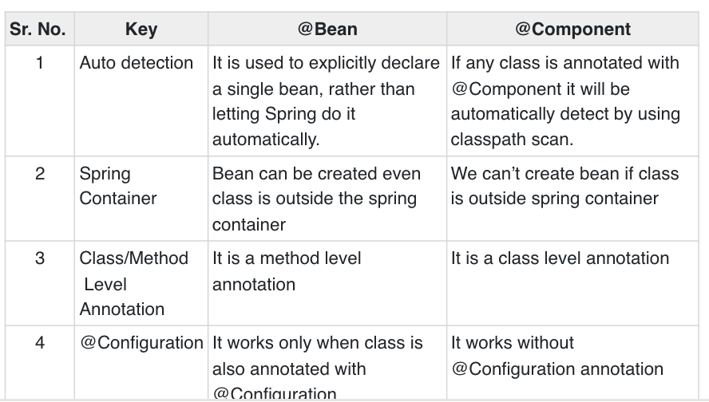

- [spring-interview](#spring-interview)
  - [What is enterprise java application?](#what-is-enterprise-java-application)
  - [1. Why Spring is so popular?](#1-why-spring-is-so-popular)
    - [a. Dependency Injection](#a-dependency-injection)
      - [Before Spring](#before-spring)
      - [After Spring](#after-spring)
    - [b. Spring IoC framework is the reason why Spring is popular.](#b-spring-ioc-framework-is-the-reason-why-spring-is-popular)
    - [c. Spring has really good integration with other frameworks.](#c-spring-has-really-good-integration-with-other-frameworks)
  - [2. Spring Modules](#2-spring-modules)
  - [3. what is auto-wiring?](#3-what-is-auto-wiring)
  - [4. what is @SpringBootApplication?](#4-what-is-springbootapplication)
    - [4.1. @Configuration](#41-configuration)
  - [@Bean vs @Component](#bean-vs-component)
- [Spring(Infosys question)](#springinfosys-question)
  - [Srping Bean scrope?](#srping-bean-scrope)
  - [Spring framework:Tell me about spring boot](#spring-frameworktell-me-about-spring-boot)
  - [Describe annotation for each of the Spring MVC application layers?](#describe-annotation-for-each-of-the-spring-mvc-application-layers)
  - [Describe the spring application workflow](#describe-the-spring-application-workflow)
  - [actuator](#actuator)
  - [Spring framework:Tell me about spring boot](#spring-frameworktell-me-about-spring-boot-1)
  - [Do you know what stereotypes and annotations are](#do-you-know-what-stereotypes-and-annotations-are)
  - [What is dependencies Injection?](#what-is-dependencies-injection)
  - [How many types of beans in spring?](#how-many-types-of-beans-in-spring)
  - [What annotations that are use in Spring?](#what-annotations-that-are-use-in-spring)
  - [What is the difference between spring and springboot?](#what-is-the-difference-between-spring-and-springboot)
  - [spring boot vs spring mvc?](#spring-boot-vs-spring-mvc)
  - [What are the annotations that you know for spring jpa and what do they mean?](#what-are-the-annotations-that-you-know-for-spring-jpa-and-what-do-they-mean)
  - [What is an Http session?](#what-is-an-http-session)
  - [Where would you do the configuration in a spring project?](#where-would-you-do-the-configuration-in-a-spring-project)
  - [Describe the spring application workflow](#describe-the-spring-application-workflow-1)
  - [What is @RestController?](#what-is-restcontroller)
  - [dao vs repository](#dao-vs-repository)

# spring-interview
## What is enterprise java application?
Enterprise applications are about the display, manipulation, and storage of large amounts of often ***complex*** data and the support or ***automation*** of business processes with that data.

https://youtu.be/2prdt2byiTs
## 1. Why Spring is so popular?
### a. Dependency Injection
#### Before Spring
```java
ProductDao productDao = new ProductDaoImpl();
```
  * if we want to change the implementation of ProductDao, we need to change the ProductDaoImpl class.
  
#### After Spring
```java
@Autowired
ProductDao productDao;
```
  * If we want to change the implementation of ProductDao, we don't need to change the ProductDaoImpl class. Just change the xml configuration file.
  * Spring will inject the dependency automatically.(inversion of control)

### b. Spring IoC framework is the reason why Spring is popular.

### c. Spring has really good integration with other frameworks.

## 2. Spring Modules


## 3. what is auto-wiring?
* spring container can autowire dependencies into interacting beans.
* After enabling annotation injection, we can use autowiring on properties, setters, and constructors.
  * @Autowired on Properties
  * @Autowired on Setters
  * @Autowired on Constructors

## 4. what is @SpringBootApplication?
```java
@SpringBootApplication
class VehicleFactoryApplication {

    public static void main(String[] args) {
        SpringApplication.run(VehicleFactoryApplication.class, args);
    }
}
```
* `@SpringBootApplication` encapsulates `@Configuration`, `@EnableAutoConfiguration`, and `@ComponentScan` annotations with their default attributes.
### 4.1. @Configuration
* @EnableAutoConfiguration, as its name says, enables auto-configuration. It means that Spring Boot looks for auto-configuration beans on its classpath and automatically applies them.

Note, that we have to use this annotation with @Configuration:
```java
@Configuration
@EnableAutoConfiguration
class VehicleFactoryConfig {}
```

## @Bean vs @Component



<hr>

# Spring(Infosys question)

## Srping Bean scrope?
https://www.baeldung.com/spring-bean-scopes
* definition
  * The scope of a bean defines the life cycle and visibility of that bean in the contexts we use it.
https://www.baeldung.com/spring-bean-scopes
  * singleton
  * prototype
  * request
  * session
  * application
  * websocket

## Spring framework:Tell me about spring boot 

## Describe annotation for each of the Spring MVC application layers?
  * https://www.youtube.com/watch?v=xkDBaldNki4
  * As the name suggests, it's a module of the Spring framework dealing with the Model-View-Controller or MVC pattern. It combines all the advantages of the MVC pattern with the convenience of Spring.
  * Spring MVC annotation
    * https://www.baeldung.com/spring-mvc-annotations
## Describe the spring application workflow
## actuator
## Spring framework:Tell me about spring boot
## Do you know what stereotypes and annotations are
## What is dependencies Injection?
## How many types of beans in spring?
## What annotations that are use in Spring? 

## What is the difference between spring and springboot? 

## spring boot vs spring mvc?
  * spring mvc
    * is a web framework built on Java Servelet Api
    * simplifies & enriches development of web applications based on java servlet stack
    * is part of spring framwork core
    * Developers user spring mvc to create web apps running on a servlet container such as Tomcat, Jetty, or Glassfish.
  * spring boot 
    * is a way that helps developer get started with spring framework with minimum effort
    * makes it easy to create stand-alone, production-grade spring based apps.
    * is a project of spring platform
    * developer user spring boot to save time and increace productivity in developing spring based applications running as a standalone application.

## What are the annotations that you know for spring jpa and what do they mean? 
## What is an Http session? 
* In simpler terms, a session is a state consisting of several requests and response between the client and the server.
* It is a known fact that HTTP and Web Servers are both stateless. Hence, the only way to maintain the state of the user is by making use of technologies that implement session tracking.
## Where would you do the configuration in a spring project? 
## Describe the spring application workflow
## What is @RestController? 

## dao vs repository
* DAO is an abstraction of data persistence. However, a repository is an abstraction of a collection of objects
* DAO is a lower-level concept, closer to the storage systems. However, Repository is a higher-level concept, closer to the Domain objects
* DAO works as a data mapping/access layer, hiding ugly queries. However, a repository is a layer between domains and data access layers, hiding the complexity of collating data and preparing a domain object
* DAO can't be implemented using a repository. However, a repository can use a DAO for accessing underlying storage